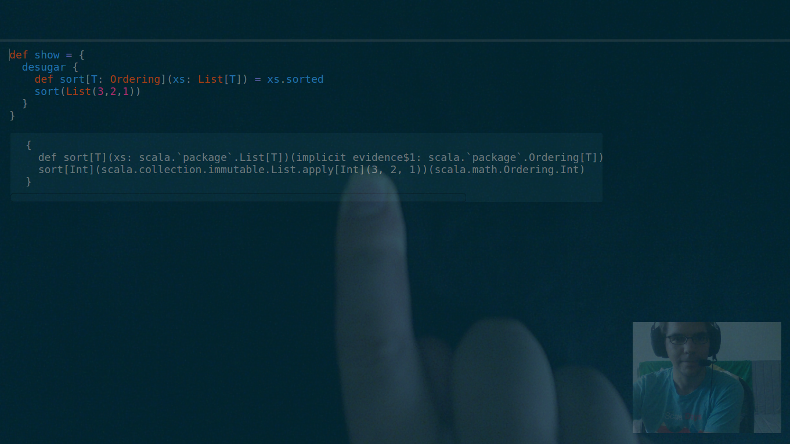
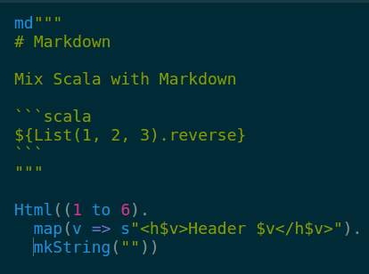
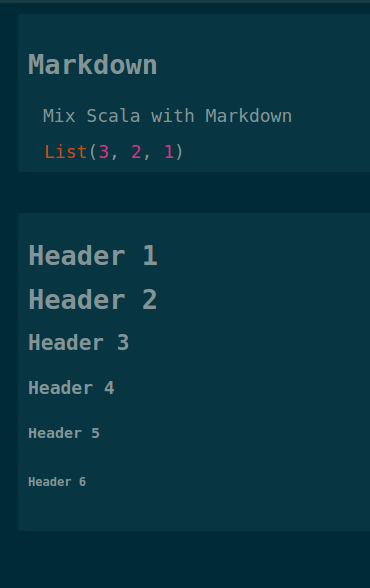
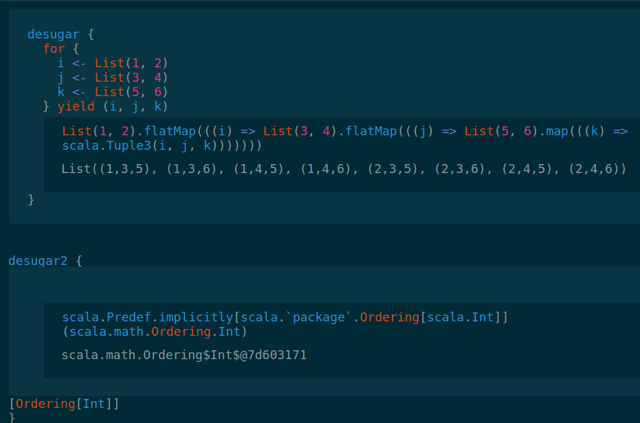
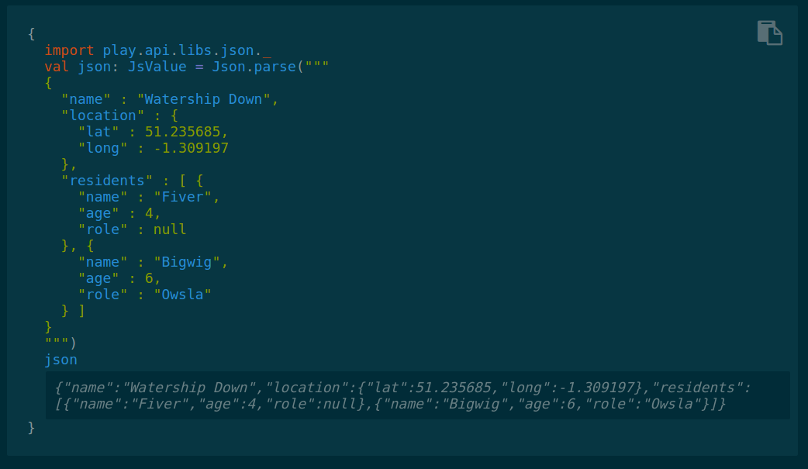

# Scala Kata



*Instructor Mode*





*Markdown and Html Rendering*



*Desugar Scala Code*



*Typesafe Documentation*

## Distributions

### Sbt Plugin

#### Per project

##### 1. add the plugin to project/plugins.sbt

```scala
addSbtPlugin("com.scalakata" % "plugin" % "0.9.0")
```

##### 2. and add the settings to your build definition build.sbt

```scala
seq(kataSettings: _*)
```

##### 3. or in your Build.scala

```scala
com.scalakata.Scalakata.kataSettings
```

#### Globally

If you want to use ScalaKata for all your projects. You can mix it to your organization plugin architecture (if any :P) or setup your machine like this:

##### 1. add the settings ~/.sbt/0.13/global.sbt

```scala
seq(kataSettings: _*)
```

##### 2. add the plugin to ~/.sbt/0.13/plugins/scalakata.sbt

```scala
addSbtPlugin("com.scalakata" % "plugin" % "0.9.0")
```

#### Run

> start with ```sbt kstart```

#### Sbt Tips

You want to try scalaz on the fly? Follow the [globally](/#globally) then

> ```sbt -sbt-create```

> ```set libraryDependencies += "org.scalaz" %% "scalaz-core" % "7.1.0"```

> ```kstart```

### Docker Container

 ##### 1. It's also possible to run scala kata in a docker container:

```
sudo docker run -p 7331:7331 --name scalakata masseguillaume/try-scala:0.9.0
```

 ##### 2. open your browser at http://localhost:7331
